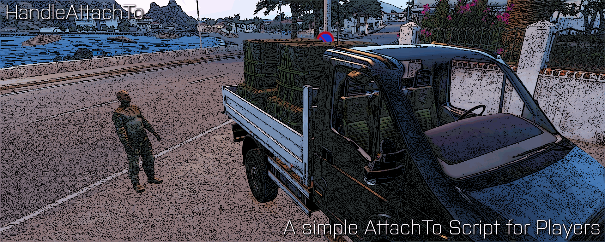

# ArmA 3 Script HandleAttachTo

  

# Support
There will be no official support.

# Pull Requests
Official-Code will remain as it is, but you are free to change it for your purposes.

## Content
It is a single ~140Code-Line-Big Script to enable the Player to attach objects with other objects via the action menu in a simple way.

## Purpose
The aim of this script is to make it easier to implement a universal script, which enables the player to attach objects in a specific manner.

## Story
This is a script that I wrote a few weeks ago for a friend. It's supposed to simplify the loading of cargo onto vehicles by the player. There are several routine integrated to avoid script errors. A description can be found inside the SQF file, how to execute the script. It's SP/MP/Dedicated and HC compatible. Have fun.

## Media

### Showcase #1 (Clip)

